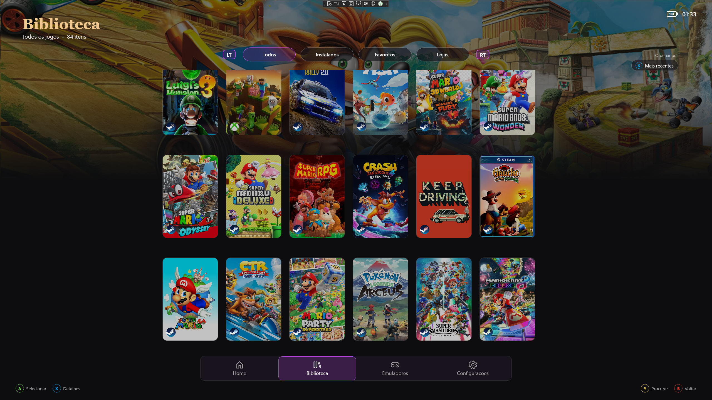
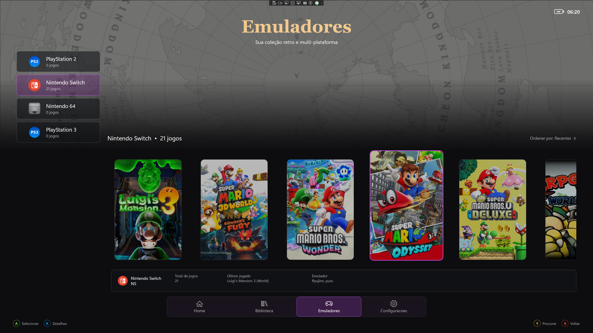

<p align="center">
  
</p>

<h1 align="center">Ludryn</h1>

<p align="center">
  Sua biblioteca de jogos de PC e emuladores em uma interface feita para controle.
</p>

<p align="center">
  <a href="../../releases/latest/download/Ludryn-Setup.exe"><strong>Baixar o Ludryn para Windows 11</strong></a>
  ·
  <a href="../../releases/latest">Ver a versão mais recente</a>
  ·
  <a href="docs/INSTALLATION.md">Guia de instalação</a>
</p>

> [!IMPORTANT]
> O Ludryn foi criado para o Xbox Full Screen Experience (FSE/Handheld Mode).
> Antes de instalar, habilite o recurso com o
> [Xbox Full Screen Experience Tool](https://github.com/ashpynov/XboxFullScreenExperienceTool/releases/latest).

## O que é o Ludryn?

O Ludryn transforma o computador em uma experiência de console: reúne jogos,
lojas e emuladores em uma única interface, navegável integralmente pelo controle.

- Detecta bibliotecas Steam, Epic Games, GOG, Ubisoft Connect, EA e Xbox.
- Organiza emuladores e pastas de ROMs por plataforma.
- Abre jogos diretamente pelo launcher ou emulador escolhido.
- Baixa capas, fundos, letreiros e ícones pela API oficial do SteamGridDB.
- Mantém cache local das artes e personalizações por perfil.
- Integra-se ao Xbox Full Screen Experience como Xbox Home App.

## Instalação rápida

1. Use uma versão atualizada do Windows 11.
2. Instale e execute o [Xbox Full Screen Experience Tool](https://github.com/ashpynov/XboxFullScreenExperienceTool/releases/latest).
3. Baixe o [Ludryn-Setup.exe](../../releases/latest/download/Ludryn-Setup.exe).
4. Execute o instalador e confirme a solicitação de administrador.
5. Abra `Configurações > Jogos > Experiência de tela inteira` no Windows.
6. Escolha **Ludryn** como aplicativo inicial.

O instalador já contém o Ludryn, o Windows App Runtime e os componentes
necessários. Visual Studio, .NET SDK e Windows App SDK não são necessários.

O Windows SmartScreen pode exibir um aviso porque o projeto ainda usa um
certificado próprio. Confirme apenas se o arquivo foi baixado desta página
oficial de Releases.

## Interface

### Biblioteca



### Emuladores



## SteamGridDB

As artes são opcionais e usam exclusivamente a API oficial do SteamGridDB.
Cada usuário deve criar sua própria chave e adicioná-la em:

```text
Configurações > SteamGridDB
```

A chave permanece somente no computador do usuário e não é incluída no
repositório ou no instalador.

## Ajuda e desenvolvimento

- Encontrou um problema? [Abra uma issue](../../issues/new/choose).
- Veja o [guia completo de instalação](docs/INSTALLATION.md).
- Para compilar ou contribuir, consulte [Desenvolvimento](docs/DEVELOPMENT.md).
- Consulte as mudanças em [CHANGELOG.md](CHANGELOG.md).

## Avisos

Ludryn é um projeto independente e não é afiliado à Microsoft, Xbox, Valve,
Epic Games, GOG, Ubisoft, Electronic Arts, SteamGridDB ou aos desenvolvedores
dos emuladores compatíveis. Marcas e imagens pertencem aos seus respectivos
proprietários.
